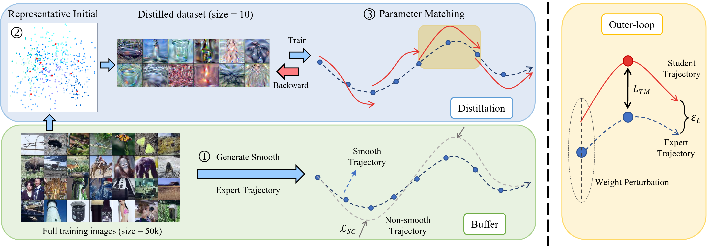

# AST: Distilling Dataset through Alignment with Smooth and High-Quality Expert Trajectories



 In this paper, unlike previous methods that focus solely on improving the effectiveness of student distillation, we are the first to recognize the important mutual influence between expert and student models. When employing more potent expert models, we argue that the smoothness of expert trajectories has a significant impact on subsequent student parameter alignment. Based on this, we propose the integration of clipping loss and gradient penalty to regulate the rate of parameter changes in expert trajectory generation. To further refine the student parameter alignment with expert trajectory, we propose representative initialization for synthetic dataset and balanced inner-loop loss in response to the sensitivity exhibited towards randomly initialized variables during distillation. We also propose two enhancement strategies, namely intermediate matching loss and weight perturbation, to mitigate the potential occurrence of cumulative errors.

## Generating Expert Trajectories
Before doing any distillation, you'll need to generate some expert trajectories using ```buffer.py```

The following command will train 100 ConvNet models on CIFAR-100 with ZCA whitening for 50 epochs each:
```bash
python buffer.py --dataset=CIFAR100 --model=ConvNet --optim SGDMOM --loss_decay --gp True --train_epochs=50 --num_experts=100 --zca --buffer_path={path_to_buffer_storage} --data_path={path_to_dataset}
```
We used 50 epochs with the default learning rate for all of our experts. Can also refer to the ```buffer.sh```.
Worse (but still interesting) results can be obtained faster through training fewer experts by changing ```--num_experts```. Note that experts need only be trained once and can be re-used for multiple distillation experiments.


## Distillation by Matching Training Trajectories
The following command will then use the buffers we just generated to distill CIFAR-100 down to just 1 image per class:
```bash
python distill.py --dataset=CIFAR100 --ipc=1 --pix_init avg --weight_perturb --agg_middle_loss --balance_loss --syn_steps=20 --expert_epochs=3 --max_start_epoch=20 --zca --lr_img=1000 --lr_lr=1e-05 --lr_teacher=0.01 --buffer_path={path_to_buffer_storage} --data_path={path_to_dataset}
```
Can also refer to the ```distill.sh```.

## Acknowledgments
This research is supported by the National Research Foundation, Singapore under its Strategic Capability Research Centres Funding Initiative. Any opinions, findings and conclusions or recommendations expressed in this material are those of the author(s) and do not reflect the views of National Research Foundation, Singapore. Our code is adapted from https://github.com/GeorgeCazenavette/mtt-distillation.